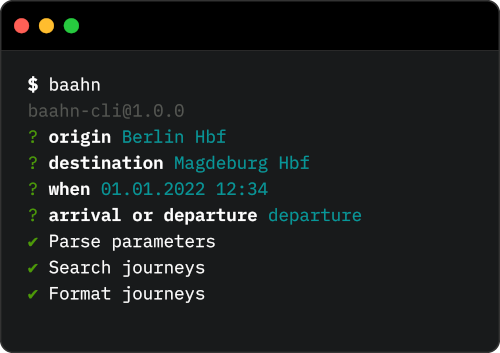

<p align="center">
  
</p>

# Baahn-CLI 🧑‍💻

Simple cli wrapper for [`baahn`] 🚂.

## Installation

```shell
npm i -g @roehrt/baahn-cli
```

## Usage

```shell
baahn
```

## See Also

[`baahn`] - the underlying javascript module

[`baahn`]: https://github.com/roehrt/baahn
