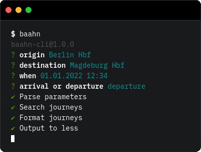

# Baahn-CLI 🧑‍💻

Simple cli wrapper for [`baahn`] 🚂.



## Installation
Currently, you need an access token to install this package 😔.
If you have one, add the GitHub Package registry (where this package
is published) to your `.npmrc`.
```
@roehrt:registry=https://npm.pkg.github.com
//npm.pkg.github.com/:_authToken=<your token>
```

Install the package with:
```shell
npm i -g @roehrt/baahn-cli
```

Run with:
```shell
baahn
```

## See Also

[`baahn`] - the underlying javascript module

[`baahn`]: https://github.com/roehrt/baahn
